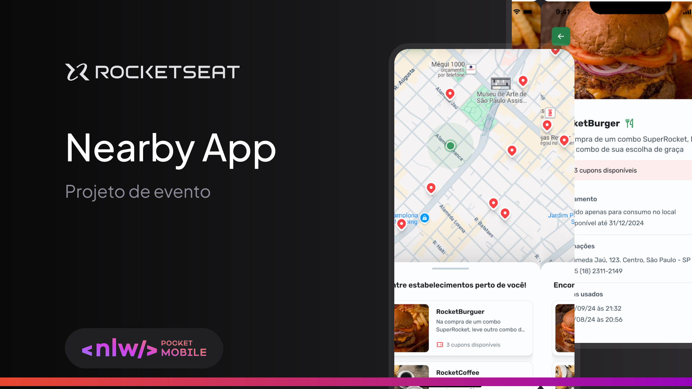

# Nearby Mobile

## Sobre projeto

O Nearby Mobile é um app para celular que te ajuda a economizar! Ele mostra cupons de desconto em lojas e restaurantes perto de você. Desenvolvido no evento <strong>NLW Pocket Mobile</strong> e é bem fácil de usar. Com ele, você descobre lugares legais e ainda economiza dinheiro.

## Funcionalidades

📈 Exploração: Veja estabelecimentos próximos que oferecem cupons de descontos.

🎁 Cupons: Resgate benefícios diretamente pelo aplicativo.

📊 Personalização: Receba sugestões de cupons baseadas em sua localização e preferências.

## Tecnologias 

- React Native : um framework de código aberto usado em vários setores e adotado com sucesso por centenas de empresas em todo o mundo, incluindo Uber, Microsoft e Facebook.

- Expo: um ecossistema de ferramentas que ajudam você
 desenvolver  análise& implantar.

- Typescript: uma linguagem de programação fortemente tipada que se baseia em JavaScript, oferecendo melhores ferramentas em qualquer escala.

- Axios: um cliente HTTP baseado-em-promessas para o node.js e para o navegador

## 👨‍💻 Colaboradores

<table>
    <tr>
         <td align="center"><a href="https://brunogoncalvesferreira.com"> <b>Bruno Gonçalves</b></a> <a href="https://github.com/brunogoncalvesferreira" title="Bruno Gonçalves Ferreira">👨‍🚀</a></td>
    </tr>
</table>